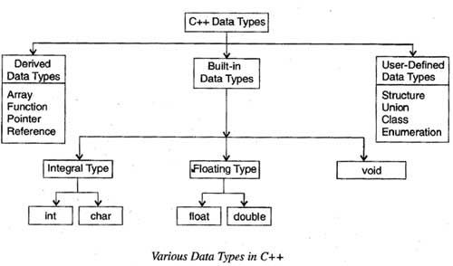

## LANGUAGES


### 3 Gross Domains:
    Business        Scientific       System
        |                |           |  |  |
      COBOL           Fortran        A  B  C


-----------------------------
### Considerations for Languages:
    Community               Redibility
    Portability             Readability
    Performance-Cost        Writeability
                            Security
                            Cost


Type coercion - a weakly typed notion:
    (float)3 + 2.0 = 5.0


Java Virtual Machine is a **Stack Machine**

    a = 2 + 6

#### stack:

     6
     2
     +
     a
     =

---


## C language:

    libC.a   static library
        .o   dynamic library


```C

#include <stdio.h>
#include "my file in this directory.h"

// always put literal constants in the compiler definitions - good practice:
#define PI 3.14159


double n = 2.0;  // this double is in global space


int main(int argc, char *argv[], char *envp[])
//    argc == count of args      
//    char *envp[] == char **envp == pointer to a pointer to a char == array of pointers to chars
{
    int d = 5;
    double m = 2.3;
    
    
    return 0;
}

```


### Data Types:



### Unions to implement polymorphism:
Struct stores all specified types, 
while Union stores the biggest of all types, changing the actual stored 
type dynamically within the one allocated space.

--------

Arrays are just adding pointers:

`A[3] == 3[A] == (&A + 3)`

----

```C
int *A;
int B;

(*A) = 3;
B = *A;  // B == 3;

B = 4;
(*A) = B;  // *A == 4;
```

-----------------------------

## C "Hello World"

```C
#include <unistd.h>

char *string = "Hello world!\n"

// string++;  // increments pointer to the next memory location

int main(int argc, char *argv[], char **envp)
{

    return write(1, (void *)string, 12);
/* file descriptor 1 is stdout
 * const void *string is the buffer, which not going to be modified (const)
 * size_t 12 is the length requested to write
 * check these with the man command - it specifies how to use the API.
 */

}
```

Show contents of the header file and other useful tools for the shell:
```bash
cat /usr/include/unistd.h

man write
man -k write
man 2 write
man read
```

--------


```
  lval    vs    rval

 address  vs   value

   &a     vs     a

    a     =      b
```

assign to address of something in C:
```C
a = &b // asigns value at &a to address of b (&b)
```

in bash it's opposite:
```
rval
$home

lval
home
```

--------


## Files

file descriptor is an int

default values that are already open are 0, 1, 2
(standard input, standard output, and standard error)

you can open new files with:
```C
int newfile;  // file descriptor
newfile = open("filename", "r/*r,w*/", )
close(newfile);
```

----

Note: get good at bit shifting!
(multiplication and division)
 - it helps with converting numbers!

----

Bitwise logic operators: (work at the bit level)

      |     or
      &     and
      ^     xor
      ~     not

Shift operators:

      <<    left (logical)
      >>    right (logical)
      >>>   arithmetic right shift (in Java) (represented in C by >> and automatically applied based on the types)
      circular shifts (C does not have a primitive operation for this, but many assembly languages do)

```C
a = 0b01011011;
a<<1; // 10110110
a>>3; // 00010110
```

We use 2's compliment to represent negative numbers and have a total order.
2's compliment is just 1's compliment plus one, and 1's comp is just bitwise negation.
So to find a negative number, these two are equivalent:

```C
-a == (~a) + 1
/* this works for negative as well as positive numbers (and zero) */
```

----

Note: review complement (the mathematical concept), it's confusing.
(1's comp, 2's comp, 10's comp, etc.)


--------


# base 64

MIME standard uses base 64 to encode text, mapping to a 
subset of the ascii table.

use least common multiple to obtain 6 bit characters from 8 
bit segments:
```
6 * 4 = 24
8 * 3 = 24
lcm(6,8) = 24
```
So we have 24-bit (3 byte) segments to read at a time and 
convert from 6-bit base 64 characters into 8-bit ascii 
characters.
```C
char a, b, c;
char v[3] = {a, b, c};
char w. x. y. z;
char u[4];
```

Use bit masks to get a longer, 4 byte pattern of the same 
4 characters:
```C
z = v & 0x3F;
y = v & (0x3F << 6);
x = v & (0x3F << 12);
w = v & (0x3F << 18);

/* Then convert by lookup table (not shown)... */

u = w | x | y | z;
```

--------


STATIC variable means the location in memory does not change.

| Mem Location   |  Type of Stuff               |
|----------------|------------------------------|
| HEAP           |  dynamic variables           |
| STACK          |  subroutines, auto variables |
| TEXT           |  code                        |
| DATA           |  static variables            |


modifiers:

static, auto, extern, 
  register, volatile

* static methods are specific to the box you put them in.
* extern methods are accessible elsewhere in the program.
* static variables exist in one location throughout the 
    runtime of the program.
* auto variables are allocated at runtime.
* register variables are actually stored in a register 
    (much faster)
* volatile variables are in shared memory and can be accessed
    and modified by other programs.


Data:
types,
qualifier,
alignment,
packing vs. padding,
endianness


Big Endian: biggest digit on bottom
Little Endian: least significant digit on bottom


